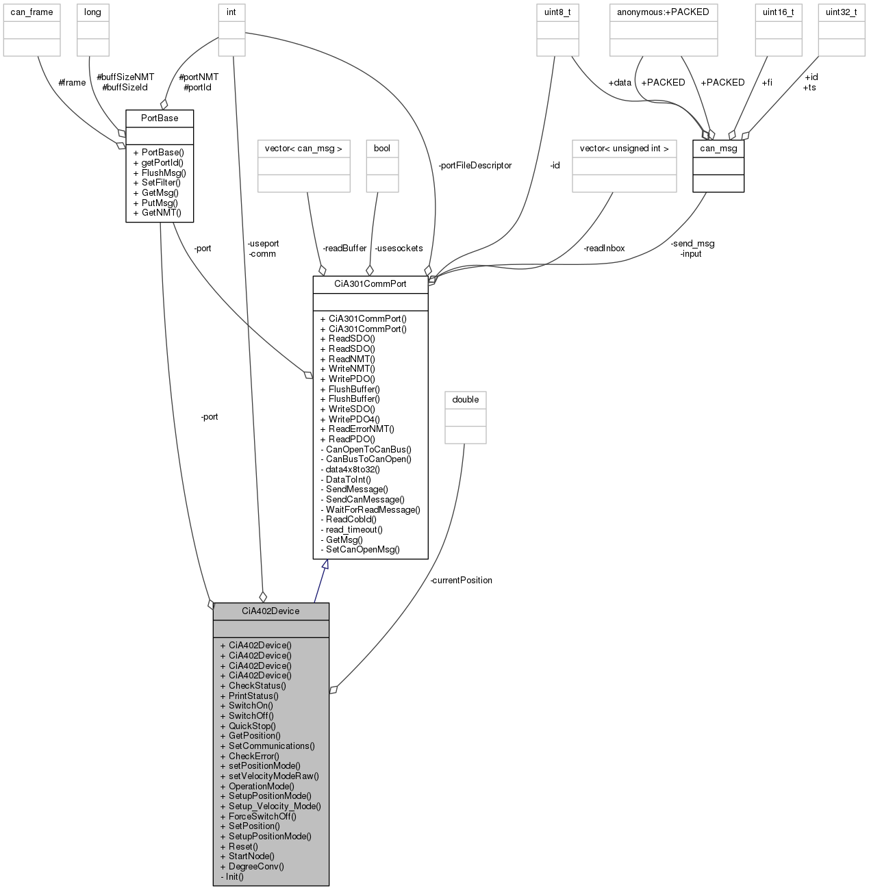

# CiA402Device
Library under CiA 402 standard for device control

# How to use

This library is intended for the use with CMake build system and SocketCan hardware. Under CMake building, it automatically holds all the include and link directories in variables:

```cmake
SUBDIR_INCLUDE_DIRECTORIES
SUBDIR_LINK_NAMES
```

Then, assuming the library is placed at "${PROJECT_SOURCE_DIR}/lib/CiA402Device/" (for example after clone with ``git clone https://github.com/HUMASoft/CiA402Device.git ``, it is enough to add the following lines to CMakeLists.txt to add includes:

```cmake
add_subdirectory(${PROJECT_SOURCE_DIR}/lib/CiA402Device/)
INCLUDE_DIRECTORIES(${SUBDIR_INCLUDE_DIRECTORIES})
```

Also after "add_executable( ${name} ${sourcefile} )" line, add the following to link the library:

```cmake
target_link_libraries( ${PROJECT_NAME} ${SUBDIR_LINK_NAMES} )
```

# Can interface
Remember to start can interface by typing these lines:

```bash
sudo ip link add dev can0 type can
sudo ip link set up can0
```

# Main classes

The library is based on the use of the class ``CiA402Device``, then the use of the functionalities will be done trough an instance of that class. A communication port is also needed, so the commo instance will be done with the following lines:

```c
//prepare port. Open a port address with a PortBase Object
SocketCanPort p1("can0");

//Create a joint and give a canopen id, and a 301port (by constructor)
CiA402Device j1(3,&p1);
```

See https://github.com/HUMASoft/CiA402Device-example for more use examples.

Troubleshooting here: https://github.com/HUMASoft/CiA402Device/wiki/Troubleshooting.


# Collaboration graph


